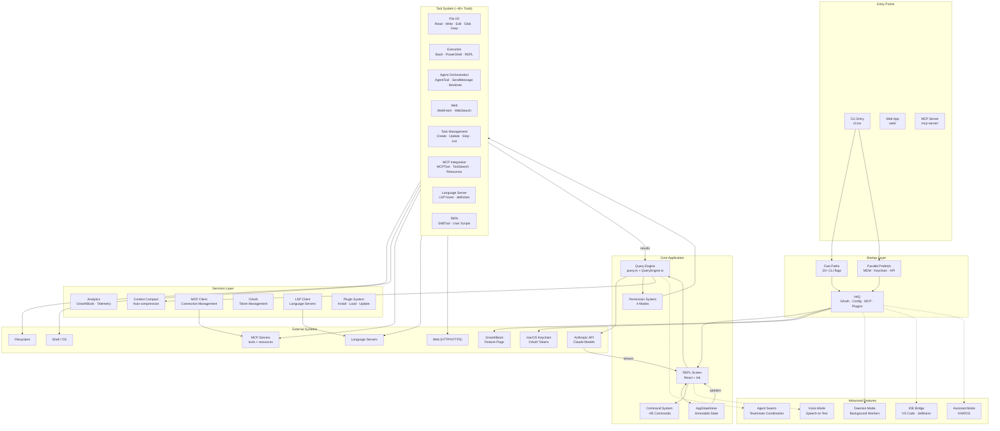

# Claude Code — Architecture

## Table of Contents
1. [Overview](#overview)
2. [End-to-End Flow](#end-to-end-flow)
3. [Monorepo Structure](#monorepo-structure)
4. [Architecture Diagram](#architecture-diagram)
5. [Key Components](#key-components)
6. [Security Architecture](#security-architecture)
7. [Advanced Features](#advanced-features)
8. [Service Layer](#service-layer)
9. [Performance Optimizations](#performance-optimizations)
10. [Tech Stack](#tech-stack)
11. [Detailed Architecture Diagrams](#detailed-architecture-diagrams)

## Overview

Claude Code is a terminal-based AI assistant that provides intelligent code assistance through natural language interaction. It features a sophisticated architecture with multiple entry points, extensive tool integration, and advanced features like multi-agent coordination and voice control.

## End-to-End Flow

### Standard CLI Flow

```
User Input
    │
    ▼
┌─────────────────────────────────────────────────────────────┐
│ Startup (cli.tsx → main.tsx)                                │
├─────────────────────────────────────────────────────────────┤
│ 1. Fast Paths (zero-import)                                 │
│    ├── --version / -v / -V                                  │
│    ├── --daemon (background mode)                           │
│    ├── --bridge (IDE integration)                           │
│    ├── --tmux --worktree                                    │
│    └── 20+ other flags                                      │
│                                                             │
│ 2. Parallel Prefetch (~200ms savings)                       │
│    ├── MDM settings (plutil/reg query)                      │
│    ├── Keychain (OAuth + legacy API key)                    │
│    └── API preconnection (TCP+TLS warmup)                   │
│                                                             │
│ 3. Full Initialization (init.ts)                            │
│    ├── enableConfigs()                                      │
│    ├── OAuth account setup                                  │
│    ├── MCP server connections                               │
│    ├── Plugin loading                                       │
│    ├── Skill initialization                                 │
│    └── GrowthBook feature flags                             │
└─────────────────────────────────────────────────────────────┘
    │
    ▼
┌─────────────────────────────────────────────────────────────┐
│ REPL Screen (React + Ink)                                   │
├─────────────────────────────────────────────────────────────┤
│ PromptInput                                                 │
│ ├── Vim mode support                                        │
│ ├── Slash command detection                                 │
│ │   └── /commit, /review, /compact, /doctor, etc.           │
│ └── Natural language processing                             │
│     └── handlePromptSubmit()                                │
│                                                             │
│ Messages                                                    │
│ ├── Scrollable transcript (virtualized)                     │
│ ├── Tool use blocks with progress                           │
│ └── Syntax highlighting                                     │
│                                                             │
│ Footer                                                      │
│ ├── Live token cost tracking                                │
│ ├── Task count indicator                                    │
│ └── Status indicators (tmux, teams, bridge, etc.)           │
└─────────────────────────────────────────────────────────────┘
    │
    ├── Slash command ───────────────────┐
    │                                      ▼
    │                         ┌────────────────────────────┐
    │                         │ Command System (~85 cmds)  │
    │                         ├────────────────────────────┤
    │                         │ PromptCommand              │
    │                         │   /commit, /review          │
    │                         │ LocalCommand                │
    │                         │   /cost, /version           │
    │                         │ LocalJSXCommand            │
    │                         │   /doctor, /config          │
    │                         └────────────────────────────┘
    │                                      │
    └──────────────────────────────────────┘
                                           │
                                           ▼
┌─────────────────────────────────────────────────────────────┐
│ Query Engine (query.ts + QueryEngine.ts)                    │
├─────────────────────────────────────────────────────────────┤
│ 1. Build System Prompt                                      │
│    ├── Base system prompt                                   │
│    ├── CLAUDE.md memory files                               │
│    ├── Git context (branch, status, diff)                   │
│    ├── Recent files                                         │
│    └── Tool descriptions                                    │
│                                                             │
│ 2. POST /messages → Anthropic API (streaming)               │
│    ├── Model selection (with overrides)                     │
│    ├── Token budget tracking                                │
│    ├── Extended thinking mode (if enabled)                  │
│    └── Budget limits enforcement                            │
│                                                             │
│ 3. Stream Processing Loop                                   │
│    ├── content_block_start                                  │
│    ├── content_block_delta (streaming text)                 │
│    ├── content_block_stop                                   │
│    └── tool_use blocks ───────────────────────────┐         │
│                                                   │         │
│ 4. Tool Execution Flow ◄──────────────────────────┘         │
│    ├── Permission Check (useCanUseTool)                     │
│    │   ├── Mode: default/plan/bypassPermissions/auto        │
│    │   ├── Check allow/deny/ask rules                       │
│    │   └── Prompt user if needed                            │
│    │                                                        │
│    ├── Tool.call()                                          │
│    │   ├── File Tools: Read/Write/Edit/Glob/Grep           │
│    │   ├── Exec Tools: Bash/PowerShell/REPL                │
│    │   ├── Agent Tools: Spawn agents, messaging            │
│    │   ├── MCP Tools: External tool servers                │
│    │   ├── Web Tools: Fetch/Search                         │
│    │   ├── Task Tools: Background tasks                    │
│    │   └── LSP Tools: Language server ops                  │
│    │                                                        │
│    └── Append tool_result to messages                       │
│                                                             │
│ 5. Continue Loop                                            │
│    ├── Re-call API with updated context                     │
│    ├── Handle edge cases:                                   │
│    │   ├── max_output_tokens recovery                       │
│    │   ├── Auto-compact on context overflow                 │
│    │   ├── Token budget continuation                        │
│    │   └── Interrupt hooks                                  │
│    └── Repeat until stop_reason = end_turn                  │
│                                                             │
│ 6. Response Rendering                                       │
│    └── Stream to Messages component                         │
└─────────────────────────────────────────────────────────────┘
```

### Alternative Entry Points

#### Web Application Flow (web/)
```
Browser
    │
    ▼
Next.js App Router (app/)
    ├── API Routes (Server Actions)
    ├── React Components
    │   ├── Tool visualization
    │   ├── Message rendering
    │   └── File explorer
    └── WebSocket/SSE for streaming
```

#### MCP Server Flow (mcp-server/)
```
MCP Client
    │
    ▼
HTTP/SSE/WebSocket Transport
    │
    ▼
Tool Execution
    ├── File operations
    ├── Process execution
    └── Custom tools
```

## Monorepo Structure

```
claude-code/
├── src/                        # Main CLI application
│   ├── entrypoints/           # CLI entry points
│   │   ├── cli.tsx           # Fast path handler
│   │   └── init.ts           # Full initialization
│   ├── screens/              # UI screens
│   │   └── REPL.tsx          # Main interactive screen
│   ├── commands/             # ~85 slash commands
│   ├── tools/                # ~40+ built-in tools
│   ├── services/             # Core services
│   │   ├── mcp/             # MCP client & server
│   │   ├── lsp/             # Language server client
│   │   ├── analytics/       # GrowthBook & telemetry
│   │   ├── compact/         # Context compression
│   │   ├── api/             # External API clients
│   │   └── plugins/         # Plugin management
│   ├── state/               # State management
│   │   └── AppStateStore.ts
│   ├── hooks/               # React hooks
│   ├── components/          # React/Ink components
│   ├── query/               # Query engine
│   ├── utils/               # Utilities
│   └── skills/              # User-defined skills
│
├── web/                       # Next.js web interface
│   ├── app/                  # Next.js app router
│   ├── components/           # React components
│   ├── hooks/                # Custom hooks
│   └── lib/                  # Utilities
│
├── mcp-server/                # Standalone MCP server
│   ├── src/                  # Server implementation
│   └── api/                  # Transport handlers
│
├── bun.lock                  # Bun lock file
├── package-lock.json         # NPM lock file (legacy)
└── package.json              # Root configuration
```

## Architecture Diagram



## Key Components

### 1. Entry Points (`src/entrypoints/`)

#### CLI Entry (`cli.tsx`)
The bootstrap entrypoint with fast-path optimizations:

**Fast Paths (zero imports):**
- `--version` / `-v` / `-V` - Version output
- `--dump-system-prompt` - System prompt extraction
- `--claude-in-chrome-mcp` - Chrome extension MCP
- `--computer-use-mcp` - Computer automation MCP
- `--daemon-worker=<kind>` - Background workers
- `daemon` / `bridge` / `remote` - Special modes

**Performance Optimization:**
- Dynamic imports for all non-fast paths
- ~135ms savings from parallel prefetching

*See detailed diagram: [docs/architecture/startup.md](docs/architecture/startup.md)*

#### Main Initialization (`main.tsx`)
Heavy initialization with parallel operations:

```typescript
// Runs in parallel before heavy imports
startMdmRawRead();           // MDM settings
startKeychainPrefetch();     // OAuth tokens

// Then: OAuth, configs, MCP, plugins, skills
init();
```

### 2. State Management (`src/state/`)

#### AppStateStore
Single immutable store for all application state (~570 lines):

```typescript
type AppState = {
  settings: SettingsJson
  mainLoopModel: ModelSetting
  mcp: {
    clients: Map<string, MCPClient>
    tools: Tool[]
    commands: Command[]
    resources: McpResource[]
  }
  plugins: {
    enabled: string[]
    disabled: string[]
    commands: Command[]
  }
  tasks: { [taskId: string]: TaskState }
  toolPermissionContext: ToolPermissionContext
  agentNameRegistry: Map<string, AgentId>
  fileHistory: FileHistoryState
  todos: { [agentId: string]: TodoList }
}
```

**Patterns:**
- Immutable updates via `setState(updater)`
- Pub-sub via `subscribe(listener)`
- Side-effects via `onChangeAppState()`

*See detailed diagram: [docs/architecture/state.md](docs/architecture/state.md)*

### 3. REPL Screen (`src/screens/REPL.tsx`)

Main interactive UI (~5000 lines) using React + Ink:

**Components:**
- **PromptInput** - Vim mode, history, slash suggestions
- **Messages** - Virtualized scrollable transcript
- **Footer** - Cost, tasks, status indicators

**Key Hooks:**
- `useAppState()` / `useSetAppState()` - State access
- `useMergedTools()` - Built-in + MCP tools
- `useMergedCommands()` - Built-in + plugin commands
- `useCanUseTool()` - Permission checking
- `useQueueProcessor()` - Command queue
- `useTasksV2WithCollapseEffect()` - Task management

### 4. Command System (`src/commands/`)

~85 commands organized by type:

| Type | Interface | Examples |
|------|-----------|----------|
| `PromptCommand` | Returns prompt text | `/commit`, `/review`, `/compact` |
| `LocalCommand` | Text output | `/cost`, `/version`, `/context` |
| `LocalJSXCommand` | React JSX output | `/doctor`, `/config`, `/resume` |

**Key Commands:**
- `/commit` - Generate commit messages
- `/review` - Code review (ultrareview variant)
- `/compact` - Context compaction
- `/diff` - Git diff display
- `/doctor` - Diagnostics
- `/mcp` - MCP server management
- `/plugins` - Plugin management
- `/tasks` - Task management

### 5. Query Engine (`src/query.ts` + `src/QueryEngine.ts`)

The core conversation loop (~1730 lines):

**QueryEngine Class:**
```typescript
class QueryEngine {
  private mutableMessages: Message[]
  private abortController: AbortController
  private permissionDenials: SDKPermissionDenial[]
  private totalUsage: NonNullableUsage
  
  async *submitMessage(prompt, options): AsyncGenerator<SDKMessage>
}
```

**Query Loop States:**

| State | Description |
|-------|-------------|
| `completed` | Normal termination |
| `blocking_limit` | Hit rate/compute limits |
| `max_turns` | Exceeded max iterations |
| `tool_use` | Execute tool and continue |
| `reactive_compact_retry` | Compress and retry |
| `max_output_tokens_recovery` | Recover from token limit |
| `token_budget_continuation` | Continue with budget |

**Edge Case Handling:**
- Auto-compact on context overflow
- Token budget tracking
- Stop hooks for interruption
- Error recovery

*See detailed diagram: [docs/architecture/query-engine.md](docs/architecture/query-engine.md)*

### 6. Tool System (`src/tools/`)

Tool interface (~794 lines):

```typescript
type Tool<Input, Output, P> = {
  name: string
  aliases?: string[]
  inputSchema: Input  // Zod schema
  
  call(args, context, canUseTool, parentMessage, onProgress): Promise<ToolResult<Output>>
  
  isConcurrencySafe(input): boolean
  isReadOnly(input): boolean
  isDestructive?(input): boolean
  
  checkPermissions(input, context): Promise<PermissionResult>
  
  description(input, options): Promise<string>
  renderToolUseMessage()
  renderToolResultMessage()
}
```

**Tool Categories:**

| Category | Tools | Purpose |
|----------|-------|---------|
| File I/O | Read, Write, Edit, Glob, Grep | File operations |
| Execution | Bash, PowerShell, REPL | Shell/command execution |
| Agent | AgentTool, SendMessage, Worktree | Multi-agent coordination |
| Web | WebFetch, WebSearch | Web access |
| Task | Create, Get, Update, Stop, List | Background tasks |
| MCP | MCPTool, ToolSearch, Resources | External tool servers |
| LSP | LSPTool | Language server operations |
| Skills | SkillTool | User-defined scripts |

*See detailed diagram: [docs/architecture/tools.md](docs/architecture/tools.md)*

### 7. Permission System (`src/hooks/useCanUseTool.ts`)

**Permission Modes:**

| Mode | Behavior | Use Case |
|------|----------|----------|
| `default` | Prompt for destructive/write ops | Interactive use |
| `plan` | Read-only; all writes blocked | Planning/analysis |
| `bypassPermissions` | All tools allowed | Testing/trusted envs |
| `auto` | Follow allow/deny/ask rules | Autonomous operation |

**Permission Rules Structure:**
```typescript
type ToolPermissionRulesBySource = {
  [source: string]: Array<{
    pattern: string          // Tool name pattern
    ruleContent?: string     // Optional content rule
  }>
}
```

**Checking Flow:**
1. Check deny rules (blanket + content-specific)
2. Check allow rules
3. Check ask rules
4. Run tool-specific `checkPermissions()`
5. Prompt user if no rule matches (default mode)

*See detailed diagrams: [docs/architecture/commands.md](docs/architecture/commands.md), [docs/architecture/security.md](docs/architecture/security.md)*

## Security Architecture

Claude Code implements multi-layer input sanitization and security to protect against prompt injection, Unicode exploits, and malicious tool execution.

### Security Pipeline

```
User Input
    │
    ▼
┌─────────────────────────────────────────────────────────────┐
│ Input Sanitization                                          │
│ ├── Unicode hardening (sanitization.ts)                    │
│ │   ├── NFKC normalization                                  │
│ │   ├── Category filtering (Cf/Co/Cn)                       │
│ │   └── Zero-width/RTL character removal                    │
│ │                                                            │
│ ├── Bridge origin validation                                │
│ │   └── isBridgeSafeCommand() check                         │
│ │                                                            │
│ └── Hook output sanitization (10k char limit)               │
└─────────────────────────────────────────────────────────────┘
    │
    ▼
┌─────────────────────────────────────────────────────────────┐
│ Permission Check (3-Tier)                                   │
│ ├── 1. Rule Matching (allow/deny/ask)                      │
│ ├── 2. Dangerous Pattern Detection                          │
│ │   └── Blocklist: eval, exec, sudo, ssh, kubectl           │
│ └── 3. YOLO Classifier (auto mode only)                     │
│     └── Secondary LLM for ambiguous cases                    │
└─────────────────────────────────────────────────────────────┘
    │
    ▼
┌─────────────────────────────────────────────────────────────┐
│ Tool Execution                                              │
│ ├── MCP output truncation (25k tokens)                      │
│ ├── PreToolUse / PostToolUse hooks                          │
│ └── Trust gate enforcement                                  │
└─────────────────────────────────────────────────────────────┘
```

### Key Security Components

| Layer | File | Purpose |
|-------|------|---------|
| Unicode sanitization | `src/utils/sanitization.ts` | NFKC + Unicode category filtering |
| Dangerous patterns | `src/utils/permissions/dangerousPatterns.ts` | Shell command blocklist |
| Bridge validation | `src/commands.ts` | `isBridgeSafeCommand()` |
| Hook execution | `src/utils/hooks.ts` | Trust gate + output limits |
| MCP validation | `src/utils/mcpValidation.ts` | Token capping |
| YOLO classifier | `src/utils/permissions/yoloClassifier.ts` | Auto-mode secondary LLM |

### Security Gaps (Documented)

- **Hook output sanitization**: Not applied to hook `additionalContext`
- **Web API auth**: `web/app/api/*` routes lack authentication
- **Settings integrity**: No hash verification on `settings.json`

*See [prompt-harden.md](./prompt-harden.md) for detailed threat model and recommendations.*

## Advanced Features

### 1. Daemon Mode

Background worker process architecture:

```
Supervisor Process
    ├── Worker 1 (task type A)
    ├── Worker 2 (task type B)
    └── Worker N (...)
```

**Use Cases:**
- Long-running operations
- Background file watching
- Persistent sessions
- Scheduled tasks

**CLI Integration:**
```bash
claude daemon          # Start supervisor
claude ps              # List sessions
claude logs <id>       # View logs
claude attach <id>     # Attach to session
```

### 2. IDE Bridge

Bi-directional integration with IDEs:

**Supported IDEs:**
- VS Code (via extension)
- JetBrains (via plugin)

**Features:**
- File synchronization
- Selection sharing
- Inline suggestions
- Diagnostic display
- Command execution from IDE

**Protocol:**
- WebSocket/SSE for real-time communication
- JSON-RPC for command execution
- File watching for sync

### 3. Agent Swarm (Teammate Coordination)

Multi-agent task distribution system:

```
Leader Agent
    ├── Agent A (Frontend)
    ├── Agent B (Backend)
    └── Agent C (DevOps)
```

**Key Components:**
- **SendMessageTool** - Inter-agent communication
- **Permission Sync** - Cross-agent permission handling
- **Team Memory** - Shared context between agents
- **Mailbox System** - Async message queue

**Features:**
- Parallel task execution
- Role-based agents
- Shared file state
- Coordinated permissions

### 4. Voice Mode

Speech-to-text integration (feature-gated):

**Architecture:**
```
Microphone → STT Engine → Text Input → Query Engine
                ↑
         WebRTC / Native API
```

**Components:**
- `useVoiceIntegration()` hook
- Real-time transcription
- Voice command recognition
- Audio playback for responses

### 5. Assistant Mode (KAIROS)

AI assistant persona with different interaction patterns:

**Features:**
- Install wizard for onboarding
- Session chooser for resumption
- Different system prompts
- Task-oriented workflows
- Companion mode for pair programming

## Service Layer

### 1. MCP Integration (`src/services/mcp/`)

**Client Management:**
```typescript
// Connection types
McpStdioServerConfig      // Local subprocess
McpSSEServerConfig        // Server-Sent Events
McpHTTPServerConfig       // HTTP transport
McpWebSocketServerConfig  // WebSocket
McpSdkServerConfig        // In-process SDK
McpClaudeAIProxyServerConfig  // Claude.ai proxy
```

**Connection States:**
- `ConnectedMCPServer` - Active connection
- `FailedMCPServer` - Connection failed
- `NeedsAuthMCPServer` - OAuth required
- `PendingMCPServer` - Connecting
- `DisabledMCPServer` - Disabled by policy

**Features:**
- OAuth 2.0 with token refresh
- XAA (Cross-App Access) / SEP-990
- Elicitation handling (-32042 errors)
- Session expiration detection
- Tool result truncation
- Binary content persistence

### 2. Context Compact (`src/services/compact/`)

Automatic context compression:

**Triggers:**
- Token count approaching limit
- Manual `/compact` command
- Auto-compact setting

**Strategies:**
1. **Summary-based** - Summarize old messages
2. **Removal-based** - Remove least relevant
3. **Compression-based** - Compress tool outputs

### 3. Plugin System (`src/services/plugins/`)

**Plugin Lifecycle:**
```
Discovery → Installation → Loading → Registration → Runtime
```

**Types:**
- **Bundled** - Built-in plugins
- **Installed** - User-installed from registry
- **Managed** - Enterprise-managed

**Registration:**
- Commands
- MCP servers
- Hooks
- Settings

**Management:**
```bash
/plugins install <name>
/plugins update <name>
/plugins remove <name>
/plugins list
```

### 4. LSP Client (`src/services/lsp/`)

Language Server Protocol integration:

**Features:**
- Hover information
- Go to definition
- Diagnostics
- Code actions
- Formatting

**Supported Languages:**
- TypeScript/JavaScript
- Python
- Rust
- Go
- And more via external LSPs

### 5. Analytics (`src/services/analytics/`)

**GrowthBook Integration:**
- Feature flags
- A/B testing
- Gradual rollouts

**Telemetry:**
- OpenTelemetry
- gRPC transport
- Cost tracking
- Usage metrics

*See detailed diagram: [docs/architecture/services.md](docs/architecture/services.md)*

## Performance Optimizations

### 1. Parallel Prefetch

**Before imports:**
```typescript
startMdmRawRead();       // ~20ms
startKeychainPrefetch(); // ~45ms
// Overlaps with module loading
```

**Total savings:** ~200ms on macOS startup

### 2. Fast Paths

Zero-import CLI flags:
- `--version` - No module loading
- `--daemon` - Minimal dependencies
- `--bridge` - IDE mode

### 3. Dynamic Imports

Feature-gated modules:
```typescript
const useVoiceIntegration = feature('VOICE_MODE') 
  ? require('./voice').useVoiceIntegration 
  : () => ({ /* stub */ })
```

**Eliminated from build:**
- Voice mode (if disabled)
- Assistant mode
- Coordinator mode
- Chicago MCP

### 4. Tool Deferral

MCP tools loaded on-demand:
- Initial load: Built-in tools only
- MCP tools: Fetched when first used
- Reduces startup time

### 5. Virtualized Rendering

Message list virtualization:
- Only render visible messages
- Efficient scrolling
- Handles large transcripts

### 6. File State Caching

Read file caching:
- Cache recent file contents
- Size-limited LRU
- Hash-based invalidation

## Tech Stack

| Category | Technology | Version |
|----------|-----------|---------|
| Runtime | Bun | Latest |
| Language | TypeScript | 5.7 (strict) |
| Terminal UI | React + Ink | Latest |
| CLI Parsing | Commander.js | Latest |
| Schema Validation | Zod | v4 |
| API | Anthropic SDK | v0.39 |
| MCP | @modelcontextprotocol/sdk | v1.12 |
| Auth | OAuth 2.0 + macOS Keychain | - |
| Feature Flags | GrowthBook | v1.4 |
| Telemetry | OpenTelemetry + gRPC | - |
| Code Search | ripgrep | - |
| Web Framework | Next.js | Latest |
| Styling | Tailwind CSS | Latest |

## Data Flow Summary

```
┌─────────────┐     ┌─────────────┐     ┌─────────────┐
│  User Input │────▶│    REPL     │────▶│   Command   │
│             │     │   Screen    │     │   System    │
└─────────────┘     └─────────────┘     └──────┬──────┘
                                               │
                    ┌─────────────┐            │
                    │   Anthropic │◀───────────┘
                    │     API     │
                    └──────┬──────┘
                           │
                    ┌──────┴──────┐
                    │   Stream    │
                    │   Events    │
                    └──────┬──────┘
                           │
         ┌─────────────────┼─────────────────┐
         │                 │                 │
    ┌────┴────┐      ┌────┴────┐      ┌────┴────┐
    │  Text   │      │Tool Use │      │  Error  │
    │Response │      │ Block   │      │Handler  │
    └────┬────┘      └────┬────┘      └────┬────┘
         │                │                │
         │         ┌──────┴──────┐         │
         │         │  Permission │         │
         │         │    Check    │         │
         │         └──────┬──────┘         │
         │                │                │
         │         ┌──────┴──────┐         │
         │         │ Tool.call() │         │
         │         │   Execute   │         │
         │         └──────┬──────┘         │
         │                │                │
         │         ┌──────┴──────┐         │
         │         │Tool Result  │         │
         │         │  Append     │         │
         │         └──────┬──────┘         │
         │                │                │
         └────────────────┼────────────────┘
                          │
                          ▼
                   ┌─────────────┐
                   │  Continue   │
                   │    Loop     │
                   └─────────────┘
```

---

## Detailed Architecture Diagrams

For more detailed diagrams of each component, see the [docs/architecture/](docs/architecture/) directory:

| Diagram | Description |
|---------|-------------|
| [startup.md](docs/architecture/startup.md) | CLI entry, fast paths, parallel prefetch |
| [query-engine.md](docs/architecture/query-engine.md) | Query loop, API calls, tool execution |
| [security.md](docs/architecture/security.md) | Input sanitization, permission checking |
| [tools.md](docs/architecture/tools.md) | Tool system, categories, execution |
| [commands.md](docs/architecture/commands.md) | Command system, slash commands |
| [services.md](docs/architecture/services.md) | MCP, plugins, analytics, compact |
| [state.md](docs/architecture/state.md) | State management, AppStateStore |

---

*Last updated: 2026-04-06*
*Architecture version: 2.0*