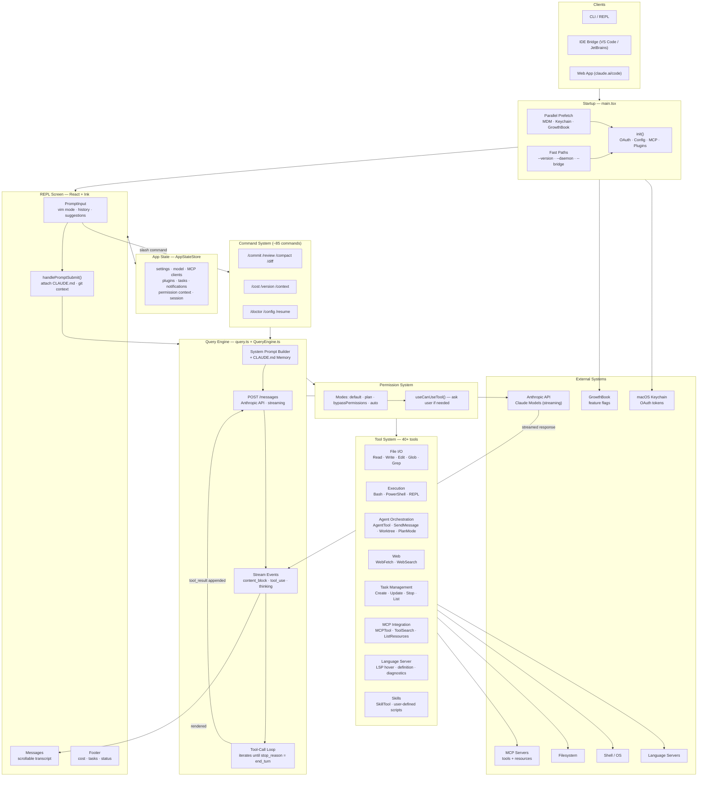

# Claude Code — Architecture

## End-to-End Flow

```mermaid
User Input
    │
    ▼
Startup (main.tsx)
├── Parallel Prefetch: MDM · Keychain · GrowthBook
├── Fast Paths: --version · --daemon · --bridge
└── init(): OAuth · Config · MCP · Plugins
    │
    ▼
REPL Screen (React + Ink)
├── PromptInput → handlePromptSubmit()
│       │
│       ├── slash command → Command System
│       └── natural prompt → Query Engine
│
▼
Query Engine (query.ts + QueryEngine.ts)
├── Build system prompt + attach CLAUDE.md memory
├── POST /messages → Anthropic API (streaming)
└── Tool-Call Loop:
        stream event → tool_use → Permission Check
        → tool.call() → tool_result → re-call API
        → repeat until stop_reason = end_turn
    │
    ▼
Messages rendered in REPL
```

## Architecture Diagram



## Key Components

### Startup (`main.tsx` → `src/entrypoints/cli.tsx`)
- Fires parallel prefetches before any heavy imports (~135ms savings)
- Handles 20+ fast-path CLI flags early (version, daemon, bridge, etc.)
- `init()` bootstraps OAuth, config, model selection, MCP servers, plugins

### REPL Screen (`src/screens/REPL.tsx`)
- React + Ink — renders directly to the terminal (no DOM)
- `PromptInput` supports vim mode, history, and slash-command suggestions
- `Messages` renders the scrollable conversation transcript
- `Footer` shows live token cost, task count, and status

### App State (`src/state/AppStateStore.ts`)
- Single immutable store: settings, model, MCP clients, plugins, tasks, notifications, permission context, session
- Side-effects via `onChangeAppState()` (persist cost, notify IDE bridge, etc.)

### Command System (`src/commands/`, ~85 commands)
| Type | Examples | Behaviour |
|------|----------|-----------|
| `PromptCommand` | `/commit`, `/review`, `/compact` | Formats a prompt and sends to LLM |
| `LocalCommand` | `/cost`, `/version`, `/context` | Runs in-process, outputs text |
| `LocalJSXCommand` | `/doctor`, `/config`, `/resume` | Runs in-process, outputs React JSX |

### Query Engine (`src/query.ts` + `src/QueryEngine.ts`)
1. Assembles system prompt + CLAUDE.md memory files
2. Calls `POST /messages` on the Anthropic API with streaming enabled
3. Enters a **tool-call loop**: each `tool_use` event triggers permission checks, tool execution, and a `tool_result` message appended to history — the API is re-called until `stop_reason = end_turn`
4. Handles edge cases: `max_output_tokens` recovery, auto-compact on context overflow, extended thinking mode

### Permission System (`src/hooks/useCanUseTool.ts`)
| Mode | Behaviour |
|------|-----------|
| `default` | Prompts user for destructive / write operations |
| `plan` | Read-only; all writes blocked |
| `bypassPermissions` | All tools allowed without prompting |
| `auto` | Autonomous; follows configured allow/deny rules |

### Tool System (`src/tools/`, 40+ tools)
Every tool implements:
```typescript
{
  name, inputSchema,
  call(args, context, canUseTool, onProgress),
  checkPermissions(input, context),
  isConcurrencySafe(input),
  isReadOnly(input),
  renderToolUseMessage(), renderToolResultMessage(),
}
```

**Categories:**
- **File I/O** — `FileReadTool`, `FileWriteTool`, `FileEditTool`, `GlobTool`, `GrepTool`
- **Execution** — `BashTool`, `PowerShellTool`, `REPLTool`
- **Agent Orchestration** — `AgentTool`, `SendMessageTool`, `EnterPlanModeTool`, `EnterWorktreeTool`
- **Web** — `WebFetchTool`, `WebSearchTool`
- **Tasks** — `TaskCreateTool`, `TaskUpdateTool`, `TaskStopTool`, `TaskListTool`
- **MCP** — `MCPTool`, `ToolSearchTool`, `ListMcpResourcesTool`, `ReadMcpResourceTool`
- **Language Server** — `LSPTool`
- **Skills** — `SkillTool`

## Tech Stack

| Category | Technology |
|----------|-----------|
| Runtime | Bun (native JSX, ES modules, fast startup) |
| Language | TypeScript (strict, v5.7) |
| Terminal UI | React + Ink |
| CLI Parsing | Commander.js |
| Schema Validation | Zod v4 |
| API | Anthropic SDK v0.39 |
| MCP | @modelcontextprotocol/sdk v1.12 |
| Auth | OAuth 2.0, macOS Keychain |
| Feature Flags | GrowthBook v1.4 |
| Telemetry | OpenTelemetry + gRPC |
| Code Search | ripgrep (via GrepTool) |
