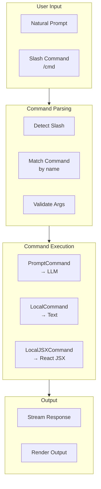
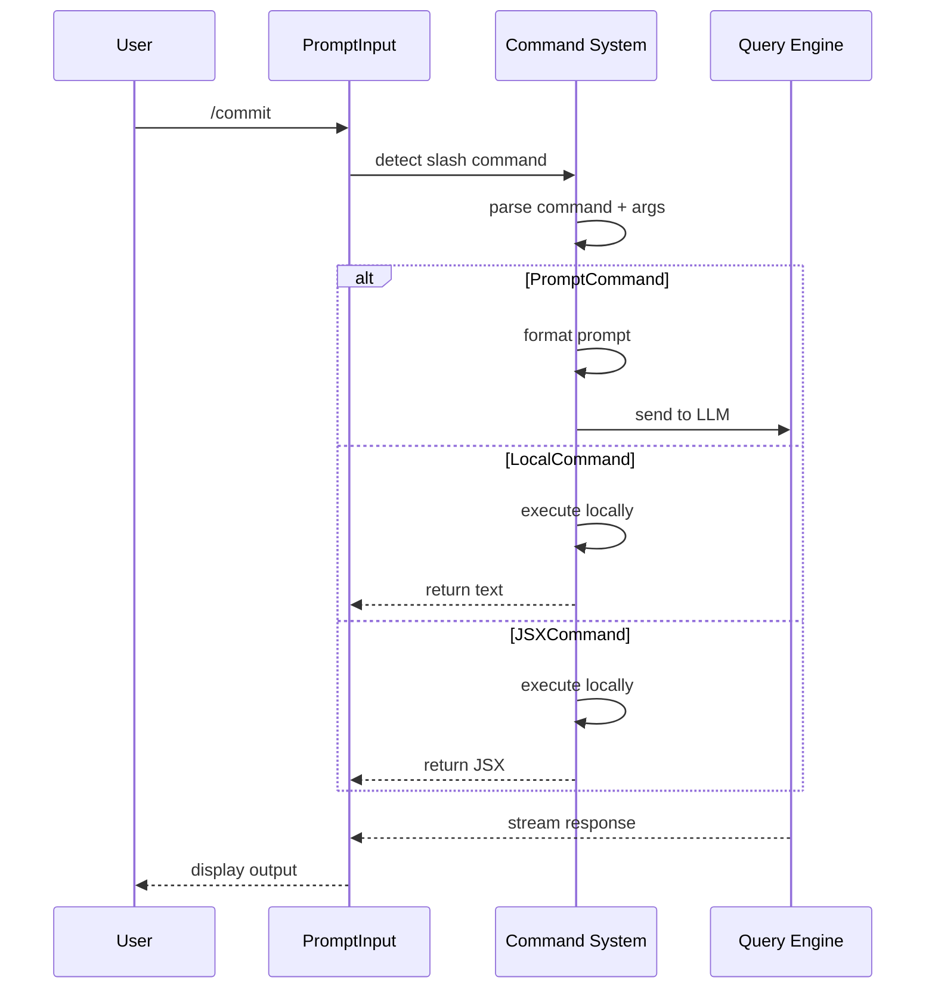

# Command System Architecture

> **Reference**: Main diagram in [ARCHITECTURE.md](../ARCHITECTURE.md)

## Overview

The Command System provides ~85 slash commands for common operations like commit, review, and configuration.

## Command Categories

## Command Types

| Type | Interface | Behavior | Examples |
|------|-----------|----------|----------|
| `PromptCommand` | Returns prompt text | Formats prompt, sends to LLM | `/commit`, `/review`, `/compact` |
| `LocalCommand` | Text output | Runs in-process, outputs text | `/cost`, `/version`, `/context` |
| `LocalJSXCommand` | React JSX output | Runs in-process, outputs React | `/doctor`, `/config`, `/resume` |

## Key Commands

| Category | Commands |
|----------|----------|
| **Git** | `/commit`, `/review`, `/diff`, `/compact` |
| **Info** | `/cost`, `/version`, `/context`, `/status` |
| **Diagnostics** | `/doctor`, `/health` |
| **Config** | `/config`, `/settings` |
| **Sessions** | `/resume`, `/clear`, `/sessions` |
| **MCP** | `/mcp add`, `/mcp list`, `/mcp remove` |
| **Plugins** | `/plugins install`, `/plugins list` |
| **Tasks** | `/tasks`, `/task create` |

## Command Execution Flow

## Key Files

| Component | File | Description |
|-----------|------|-------------|
| Command Registry | `src/commands.ts` | Command definitions (~85 commands) |
| Command Hooks | `src/hooks/useCommands.ts` | Command hooks |
| Bridge Safe Check | `src/commands.ts:isBridgeSafeCommand` | IDE bridge validation |

---

*See also: [ARCHITECTURE.md](../ARCHITECTURE.md), [query-engine.md](query-engine.md)*