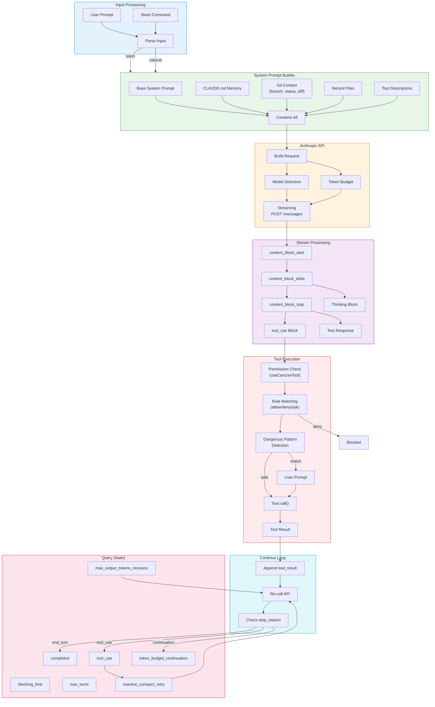

# Query Engine Architecture

> **Reference**: Main diagram in [ARCHITECTURE.md](../ARCHITECTURE.md)

## Overview

The Query Engine handles the core conversation loop - building prompts, calling the Anthropic API, processing streams, and executing tools.

## Detailed Flow Diagram

## Query Loop States

| State | Description | Action |
|-------|-------------|--------|
| `completed` | Normal termination | End conversation |
| `blocking_limit` | Rate/compute limits | Show error |
| `max_turns` | Exceeded iterations | Stop loop |
| `tool_use` | Execute tool | Continue loop |
| `reactive_compact_retry` | Compress context | Retry |
| `max_output_tokens_recovery` | Token limit hit | Recover |
| `token_budget_continuation` | Budget exhausted | Continue |

## Key Files

| Component | File | Description |
|-----------|------|-------------|
| Query Engine | `src/QueryEngine.ts` | Core query class |
| Query Loop | `src/query.ts` | Async generator loop |
| Query State | `src/query/transitions.ts` | State machine |
| Tool Executor | `src/tools/StreamingToolExecutor.ts` | Tool execution |

## Edge Case Handling

1. **Auto-compact**: Compress context when approaching token limits
2. **Token budget**: Track and enforce output token limits
3. **Max output tokens**: Recovery when API returns limit error
4. **Reactive compact**: Retry after context overflow

---

*See also: [ARCHITECTURE.md](../ARCHITECTURE.md), [security.md](security.md)*