# Security Architecture

> **Reference**: Main diagram in [ARCHITECTURE.md](../ARCHITECTURE.md)

## Overview

Multi-layer input sanitization and security architecture protecting against prompt injection, Unicode exploits, and malicious tool execution.

## Security Pipeline

```mermaid
flowchart LR
    subgraph Input["Input Layer"]
        User["User Input"]
        Bridge["IDE Bridge"]
        Hook["Hook Output"]
    end

    subgraph Sanitize["Sanitization Layer"]
        Unicode["Unicode\nSanitization"]
        BridgeCheck["Bridge\nValidation"]
        HookLimit["Hook Output\nLimit (10k)"]
    end

    subgraph PermCheck["Permission Check"]
        Rules["Rule Matching\n(allow/deny/ask)"]
        Dangerous["Dangerous\nPatterns"]
        YOLO["YOLO\nClassifier"]
    end

    subgraph ToolExec["Tool Execution"]
        MCPTrunc["MCP Truncation\n(25k tokens)"]
        Hooks["Pre/Post\nHooks"]
        Trust["Trust Gate"]
    end

    Input --> Sanitize
    Sanitize --> PermCheck
    PermCheck --> ToolExec
```



## Detailed Flow

```mermaid
flowchart TB
    A([User / Bridge Input]) --> B[processUserInput]

    B --> C{Bridge Origin?}
    C -- Yes --> D[isBridgeSafeCommand check\nskipSlashCommands enforced]
    C -- No --> E[Slash command parse]
    D --> F
    E --> F[Unicode Sanitization\nNFKC + Cf/Co/Cn filter]

    F --> G[UserPromptSubmit Hooks\nTrust gate first]
    G --> H{Hook decision}
    H -- block --> I([Blocked])
    H -- additionalContext --> J[Augmented message (10k max)]
    H -- pass --> J

    J --> K[LLM API call]

    K --> L[Tool use requested]
    L --> M[Permission Check]

    M --> N{Rule match?}
    N -- deny rule --> O([Blocked])
    N -- allow rule --> P([Execute])
    N -- no match --> Q{Dangerous pattern?}
    Q -- match --> R{Permission mode}
    R -- default/ask --> S([Prompt user])
    R -- auto --> T[YOLO Classifier]
    T -- safe --> P
    T -- unsafe --> S
    Q -- no match --> P

    P --> U{MCP tool?}
    U -- Yes --> V[MCP output truncation 25k]
    U -- No --> W[Tool result]
    V --> W

    W --> X[PreToolUse / PostToolUse Hooks]
    X --> K
```

## Key Components

| Layer | File | Mechanism |
|-------|------|-----------|
| Unicode sanitization | `src/utils/sanitization.ts` | NFKC + Unicode category filtering (Cf/Co/Cn) + zero-width/RTL removal |
| Bridge validation | `src/commands.ts` | `isBridgeSafeCommand()` |
| Dangerous patterns | `src/utils/permissions/dangerousPatterns.ts` | Blocklist: eval, exec, sudo, ssh, kubectl |
| Hook execution | `src/utils/hooks.ts` | Trust gate + output limits |
| MCP validation | `src/utils/mcpValidation.ts` | Token capping |
| YOLO classifier | `src/utils/permissions/yoloClassifier.ts` | Secondary LLM for auto mode |

## Permission Modes

| Mode | Behavior |
|------|----------|
| `default` | Prompt for destructive/write ops |
| `plan` | Read-only; all writes blocked |
| `bypassPermissions` | All tools allowed |
| `auto` | Follow allow/deny/ask rules |

## 3-Tier Permission Check

1. **Rule Matching** - Check allow/deny/ask rules
2. **Dangerous Pattern** - Shell command blocklist
3. **YOLO Classifier** - Secondary LLM (auto mode only)

## Known Gaps

| Gap | Severity | Description |
|-----|----------|-------------|
| Hook output sanitization | 🔴 High | `additionalContext` not sanitized |
| Web API auth | 🟠 Medium | `web/app/api/*` routes lack auth |
| Settings integrity | 🟠 Medium | No hash verification on `settings.json` |

---

*See also: [prompt-harden.md](../../prompt-harden.md), [ARCHITECTURE.md](../ARCHITECTURE.md)*