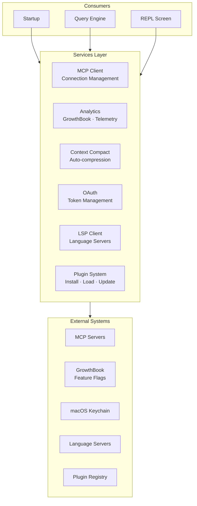
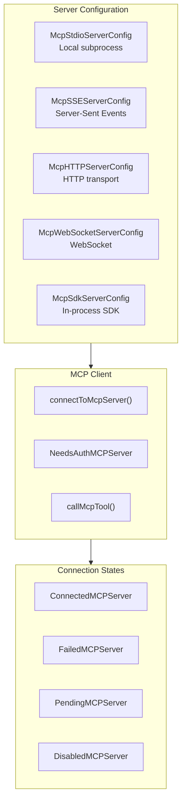

# Service Layer Architecture

> **Reference**: Main diagram in [ARCHITECTURE.md](../ARCHITECTURE.md)

## Overview

The Service Layer provides core infrastructure services including MCP, Analytics, Plugins, and more.

## Services Overview



## MCP Integration



### MCP Features
- OAuth 2.0 with token refresh
- XAA (Cross-App Access) / SEP-990
- Elicitation handling (-32042 errors)
- Session expiration detection
- Tool result truncation (25k tokens)

## Plugin System

```
Discovery → Installation → Loading → Registration → Runtime
```

### Plugin Types
- **Bundled** - Built-in plugins
- **Installed** - User-installed from registry
- **Managed** - Enterprise-managed

### Plugin Capabilities
- Commands
- MCP servers
- Hooks
- Settings

## Context Compact

**Triggers:**
- Token count approaching limit
- Manual `/compact` command
- Auto-compact setting

**Strategies:**
1. **Summary-based** - Summarize old messages
2. **Removal-based** - Remove least relevant
3. **Compression-based** - Compress tool outputs

## Key Files

| Service | File | Description |
|---------|------|-------------|
| MCP Client | `src/services/mcp/client.ts` | Connection management |
| MCP Types | `src/services/mcp/types.ts` | Server config types |
| Plugins | `src/services/plugins/` | Plugin management |
| Compact | `src/services/compact/` | Context compression |
| Analytics | `src/services/analytics/` | GrowthBook + telemetry |
| LSP | `src/services/lsp/` | Language server client |

---

*See also: [ARCHITECTURE.md](../ARCHITECTURE.md), [tools.md](tools.md)*