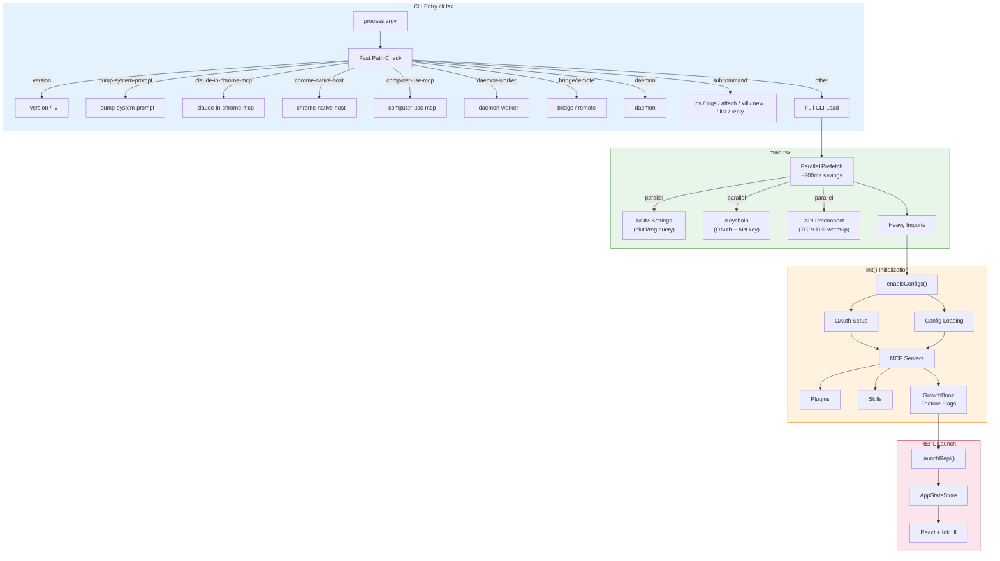

# Startup Architecture

> **Reference**: Main diagram in [ARCHITECTURE.md](../ARCHITECTURE.md)

## Overview

The startup flow handles CLI initialization, fast paths, parallel prefetching, and full application initialization.

## Detailed Flow Diagram

## Key Files

| Component | File | Description |
|-----------|------|-------------|
| CLI Entry | `src/entrypoints/cli.tsx` | Fast path handler, zero-import optimizations |
| Main Entry | `src/main.tsx` | Parallel prefetch, heavy imports |
| Initialization | `src/entrypoints/init.ts` | Full app bootstrap |
| REPL Launch | `src/replLauncher.ts` | Screen initialization |
| State Store | `src/state/AppStateStore.ts` | Application state |

## Fast Paths (Zero Import)

These flags bypass full module loading:

- `--version` / `-v` / `-V` - Version output
- `--dump-system-prompt` - System prompt extraction
- `--claude-in-chrome-mcp` - Chrome extension MCP
- `--computer-use-mcp` - Computer automation MCP
- `--daemon-worker=<kind>` - Background workers

## Performance Notes

| Optimization | Savings |
|--------------|---------|
| Parallel prefetch (MDM + Keychain) | ~135ms |
| API preconnection | ~100-200ms |
| Fast path (--version) | Full import time |

---

*See also: [ARCHITECTURE.md](../ARCHITECTURE.md)*