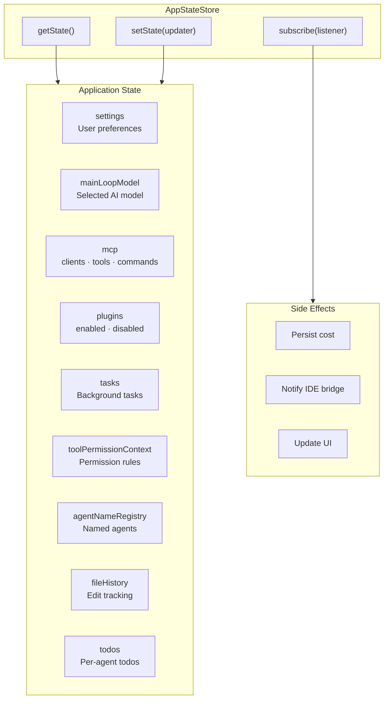
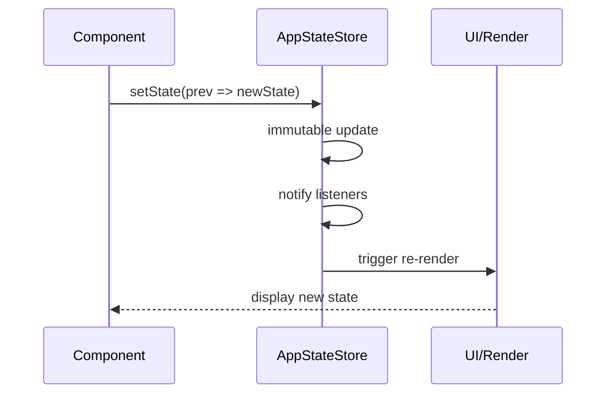

# State Management Architecture

> **Reference**: Main diagram in [ARCHITECTURE.md](../ARCHITECTURE.md)

## Overview

The State Management system provides a centralized, immutable store for all application state.

## State Architecture



## State Structure

```typescript
type AppState = {
  // Core
  settings: SettingsJson
  mainLoopModel: ModelSetting
  
  // Integration
  mcp: {
    clients: Map<string, MCPClient>
    tools: Tool[]
    commands: Command[]
    resources: McpResource[]
    pluginReconnectKey: string
  }
  
  // Extensions
  plugins: {
    enabled: string[]
    disabled: string[]
    commands: Command[]
    errors: PluginError[]
    installationStatus: InstallationStatus
    needsRefresh: boolean
  }
  
  // Tasks
  tasks: { [taskId: string]: TaskState }
  
  // Permissions
  toolPermissionContext: ToolPermissionContext
  
  // Coordination
  agentNameRegistry: Map<string, AgentId>
  
  // File State
  fileHistory: FileHistoryState
  
  // Todos
  todos: { [agentId: string]: TodoList }
  
  // ... more fields
}
```

## State Update Pattern



## Key Patterns

| Pattern | Description |
|---------|-------------|
| **Immutable updates** | `setState(updater)` returns new state |
| **Pub-sub** | `subscribe(listener)` returns unsubscribe fn |
| **Side-effects** | `onChangeAppState()` handles persistence |

## Key Files

| Component | File | Description |
|-----------|------|-------------|
| Store | `src/state/store.ts` | Simple pub-sub store |
| AppState | `src/state/AppStateStore.ts` | Full app state (~570 lines) |
| Hook | `src/hooks/useAppState.ts` | React hook for state |

---

*See also: [ARCHITECTURE.md](../ARCHITECTURE.md)*