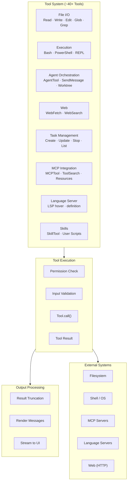
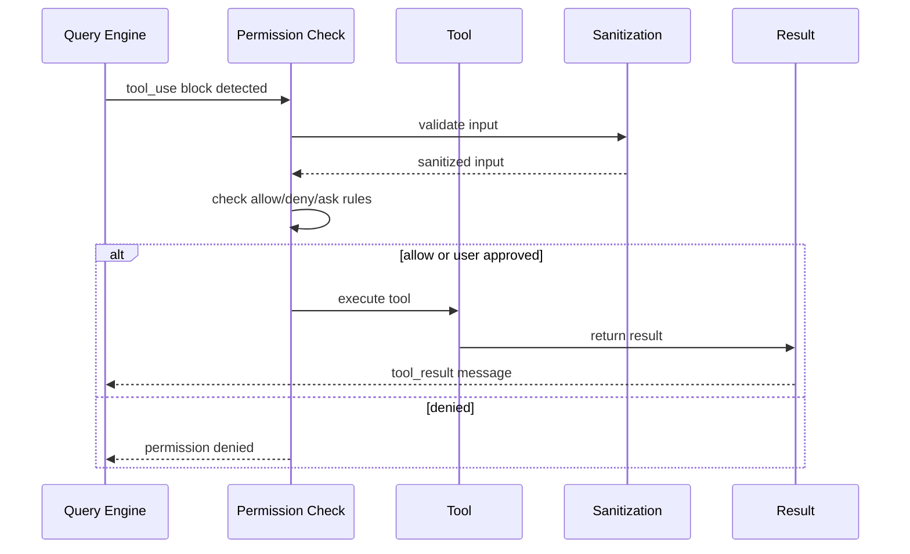

# Tool System Architecture

> **Reference**: Main diagram in [ARCHITECTURE.md](../ARCHITECTURE.md)

## Overview

The Tool System provides ~40+ built-in tools for file operations, execution, web access, and more.

## Tool Categories



## Tool Interface

```typescript
type Tool<Input, Output, P> = {
  name: string
  aliases?: string[]
  inputSchema: Input  // Zod schema
  
  call(args, context, canUseTool, parentMessage, onProgress): Promise<ToolResult<Output>>
  
  // Permissions
  isConcurrencySafe(input): boolean
  isReadOnly(input): boolean
  isDestructive?(input): boolean
  checkPermissions(input, context): Promise<PermissionResult>
  
  // UI
  description(input, options): Promise<string>
  renderToolUseMessage()
  renderToolResultMessage()
}
```

## Tool Categories Detail

| Category | Tools | Purpose |
|----------|-------|---------|
| **File I/O** | FileReadTool, FileWriteTool, FileEditTool, GlobTool, GrepTool | File operations |
| **Execution** | BashTool, PowerShellTool, REPLTool | Shell/command execution |
| **Agent** | AgentTool, SendMessageTool, EnterPlanModeTool, EnterWorktreeTool | Multi-agent coordination |
| **Web** | WebFetchTool, WebSearchTool | Web access |
| **Task** | TaskCreateTool, TaskGetTool, TaskUpdateTool, TaskStopTool, TaskListTool | Background tasks |
| **MCP** | MCPTool, ToolSearchTool, ListMcpResourcesTool, ReadMcpResourceTool | External tool servers |
| **LSP** | LSPTool | Language server operations |
| **Skills** | SkillTool | User-defined scripts |

## Tool Execution Flow



## Key Files

| Component | File | Description |
|-----------|------|-------------|
| Tool Interface | `src/Tool.ts` | Tool contract (~794 lines) |
| Tool Registry | `src/tools.ts` | `getAllBaseTools()` |
| Execution | `src/tools/StreamingToolExecutor.ts` | Streaming tool executor |

---

*See also: [ARCHITECTURE.md](../ARCHITECTURE.md), [security.md](security.md)*