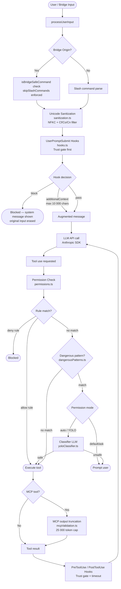

# Prompt Hardening & Input Sanitization Architecture

## Table of Contents
1. [Overview](#overview)
2. [Pipeline Diagram](#pipeline-diagram)
3. [Key Components](#key-components)
4. [Threat Model](#threat-model)
5. [Permission System Details](#permission-system-details)
6. [Input Validation Rules](#input-validation-rules)
7. [Hook Security](#hook-security)
8. [Notable Gaps](#notable-gaps)
9. [Recommendations](#recommendations)

## Overview

Claude Code implements a multi-layer input sanitization and security architecture to protect against:
- Prompt injection attacks
- Unicode-based exploits
- Malicious tool execution
- Hook-based code injection
- Cross-origin attacks from IDE bridges

## Pipeline Diagram



## Key Components

| Layer | File | Mechanism |
|---|---|---|
| Input Unicode hardening | `src/utils/sanitization.ts` | NFKC normalization + Unicode category filtering (Cf/Co/Cn) + explicit zero-width/RTL ranges |
| Bridge origin detection | `src/utils/bridgeOrigin.ts` | IDE bridge command validation |
| Permission gating | `src/utils/permissions/permissions.ts` | 3-tier: rule whitelist/blacklist → dangerous pattern detection → YOLO classifier (secondary LLM) |
| Dangerous pattern matching | `src/utils/permissions/dangerousPatterns.ts` | Cross-platform blocklist: `eval`, `exec`, `sudo`, `ssh`, `kubectl`, etc. |
| Hook execution gate | `src/utils/hooks.ts` | Trust dialog required before any hook runs; `shouldSkipHookDueToTrust()` |
| Hook output limit | `src/utils/processUserInput/processUserInput.ts` | Hook output capped at 10,000 chars before injecting into messages |
| MCP output truncation | `src/utils/mcpValidation.ts` | 25,000 token limit; image compression fallback |
| Permission rule validation | `src/utils/settings/validation.ts` | Escape-aware bracket parsing, Zod schema, per-rule filtering |
| User prompt hooks | `src/utils/processUserInput/processUserInput.ts` | `executeUserPromptSubmitHooks()` can block/augment/erase input pre-LLM |
| Token budget enforcement | `src/utils/tokenBudget.ts` | Limits output tokens, triggers continuation/compression |

## Threat Model

### 1. Prompt Injection

**Attack Vector:** Malicious instructions in user input designed to override system prompts

**Mitigations:**
- Unicode sanitization (NFKC + category filtering)
- Hook output sanitization gap (see gaps)
- LLM-based classifier for auto mode (`yoloClassifier.ts`)

### 2. Unicode Exploitation

**Attack Vector:** Zero-width characters, RTL override, homograph attacks

**Mitigations:**
- `sanitization.ts` filters:
  - Category Cf (formatting characters)
  - Category Co (private use)
  - Category Cn (unassigned)
  - Explicit zero-width ranges: U+200B to U+200F, U+FEFF
  - RTL overrides: U+202E, U+202D

### 3. Dangerous Tool Execution

**Attack Vector:** Requests to execute shell commands with malicious intent

**Mitigations:**
- Permission rule matching (allow/deny/ask)
- Dangerous pattern detection (blocklist)
- YOLO classifier for ambiguous cases
- User prompts for destructive operations

### 4. Bridge Origin Attacks

**Attack Vector:** IDE extensions sending commands that bypass safeguards

**Mitigations:**
- `isBridgeSafeCommand()` validation
- Slash command enforcement
- Origin detection and filtering

### 5. Hook-Based Code Injection

**Attack Vector:** Malicious hooks in `.claude/settings.json`

**Mitigations:**
- Trust dialog gate before hook execution
- Hook output length limits (10,000 chars)
- Input sanitization gap (see gaps)

## Permission System Details

### 3-Tier Permission Checking

```
┌─────────────────────────────────────────────────────────────┐
│                    Permission Check Flow                     │
├─────────────────────────────────────────────────────────────┤
│                                                              │
│  1. RULE MATCH                                              │
│     ├── Deny rules (explicit block)                          │
│     ├── Allow rules (explicit permit)                        │
│     └── Ask rules (prompt user)                              │
│                                                              │
│  2. DANGEROUS PATTERN DETECTION                             │
│     ├── Blocklist: eval, exec, sudo, ssh, kubectl, etc.     │
│     ├── File deletion patterns                               │
│     └── Network exfiltration patterns                       │
│                                                              │
│  3. YOLO CLASSIFIER (auto mode only)                        │
│     ├── Secondary LLM call                                   │
│     ├── Context-aware analysis                              │
│     └── Fallback to user prompt                              │
│                                                              │
└─────────────────────────────────────────────────────────────┘
```

### Permission Modes

| Mode | Behavior | Trust Level |
|------|----------|-------------|
| `default` | Prompt for destructive/write ops | Medium |
| `plan` | Read-only; all writes blocked | High (locked) |
| `bypassPermissions` | All tools allowed without prompting | Very High |
| `auto` | Follow allow/deny/ask rules | Configurable |

### Permission Rule Structure

```typescript
type ToolPermissionRule = {
  pattern: string      // Tool name pattern (glob-like)
  ruleContent?: string // Optional content-specific rule
  source: string       // 'user' | 'system' | 'enterprise'
}
```

## Input Validation Rules

### Unicode Sanitization Rules

| Category | Action | Examples |
|----------|--------|----------|
| Cf (Formatting) | Block | Zero-width spaces, joiners |
| Co (Private Use) | Block | Private use area characters |
| Cn (Unassigned) | Block | Unassigned code points |
| ZWSP | Block | Zero-width space (U+200B) |
| LRO/RLO | Block | Directional overrides |
| BOM | Strip | Byte order mark (U+FEFF) |

### Hook Output Validation

```typescript
const HOOK_OUTPUT_MAX_LENGTH = 10000; // chars
const HOOK_EXECUTION_TIMEOUT = 30000; // ms

function sanitizeHookOutput(output: string): string {
  // 1. Length check
  if (output.length > HOOK_OUTPUT_MAX_LENGTH) {
    output = output.substring(0, HOOK_OUTPUT_MAX_LENGTH);
  }
  // 2. Unicode sanitization (gap: not applied to hook output)
  // TODO: Apply sanitization.ts rules here
  return output;
}
```

### MCP Output Validation

```typescript
const MCP_OUTPUT_TOKEN_LIMIT = 25000;

function validateMcpOutput(output: string): string {
  const tokens = estimateTokens(output);
  if (tokens > MCP_OUTPUT_TOKEN_LIMIT) {
    // Truncate or compress
    return compressOutput(output, MCP_OUTPUT_TOKEN_LIMIT);
  }
  return output;
}
```

## Hook Security

### Trust Gate

Hooks are only executed after user has accepted the trust dialog:

```typescript
async function executeHook(hook: Hook): Promise<HookResult> {
  // 1. Check trust dialog acceptance
  if (!shouldSkipHookDueToTrust()) {
    return { blocked: true, reason: 'Trust not accepted' };
  }

  // 2. Validate hook source
  const settings = await loadSettings();
  const hookSource = settings.hooks?.[hook.name];
  if (!hookSource) {
    return { blocked: true, reason: 'Hook not configured' };
  }

  // 3. Execute with timeout
  const result = await withTimeout(
    executeShellCommand(hookSource),
    HOOK_EXECUTION_TIMEOUT
  );

  // 4. Sanitize output (gap: currently not applied)
  return sanitizeHookOutput(result);
}
```

### Hook Types

| Type | Trigger | Risk |
|------|---------|------|
| `UserPromptSubmit` | Before LLM call | Input injection |
| `PreToolUse` | Before tool execution | Command modification |
| `PostToolUse` | After tool execution | Output manipulation |

## Notable Gaps

### 1. 🔴 High: Hook Settings Trust

**Issue:** Hooks are arbitrary shell commands from `.claude/settings.json`. If that file is tampered with, arbitrary code runs and permissions can be dynamically upgraded via `PermissionRequest` hooks.

**Impact:** Full system compromise if settings file is writable by attacker.

**Current State:** No file integrity checking on settings.json.

### 2. 🔴 High: Hook Output Unsanitized

**Issue:** Hook `additionalContext` is injected into the message stream without Unicode sanitization, making it a potential prompt injection vector.

**Location:** `src/utils/processUserInput/processUserInput.ts` → `executeUserPromptSubmitHooks()`

**Impact:** Attackers can inject malicious prompts via hooks.

### 3. 🟠 Medium: Web API Authentication

**Issue:** Web API endpoints (`web/app/api/files/read/route.ts`) have no authentication layer; any caller can request file reads if the server is reachable.

**Impact:** Unauthorized file access if server is exposed.

### 4. 🟠 Medium: Sanitization Wiring Verification

**Issue:** `sanitization.ts` is comprehensive but worth verifying it is called on the main user prompt path and not only on MCP/tool results.

**Action:** Audit all input paths to ensure sanitization is applied consistently.

### 5. 🟡 Low: Bridge Origin Spoofing

**Issue:** IDE bridge origin detection relies on header values that could potentially be spoofed in certain configurations.

**Mitigation:** Additional validation layers help mitigate, but worth monitoring.

### 6. 🟡 Low: YOLO Classifier Bypass

**Issue:** The YOLO classifier in auto mode could potentially be bypassed with carefully crafted prompts.

**Mitigation:** User prompt fallback provides additional safety net.

## Recommendations

### Short Term (High Priority)

1. **Apply sanitization to hook output**
   ```typescript
   // In processUserInput.ts
   function executeUserPromptSubmitHooks() {
     const output = runHook();
     return sanitizeString(output);  // Apply sanitization.ts rules
   }
   ```

2. **Add settings.json integrity checking**
   ```typescript
   // Verify settings file hash on load
   async function loadSettings() {
     const settings = await readSettings();
     const hash = await computeHash(settings);
     if (hash !== knownGoodHash) {
       // Flag for review or reset to defaults
     }
     return settings;
   }
   ```

3. **Add authentication to web API routes**
   ```typescript
   // In web/app/api/*/route.ts
   export async function GET(request: Request) {
     const session = await verifySession(request);
     if (!session) return new Response('Unauthorized', { status: 401 });
     // ... proceed with operation
   }
   ```

### Medium Term

1. **Audit all input paths** for sanitization coverage
2. **Implement hook signing** for enterprise deployments
3. **Add rate limiting** to web API endpoints
4. **Enhance YOLO classifier** with more training data

### Long Term

1. **Isolated hook execution** in sandboxed containers
2. **End-to-end input validation** pipeline
3. **Security audit automation** in CI/CD

---

*Last updated: 2026-04-06*
*Security classification: Internal use only*